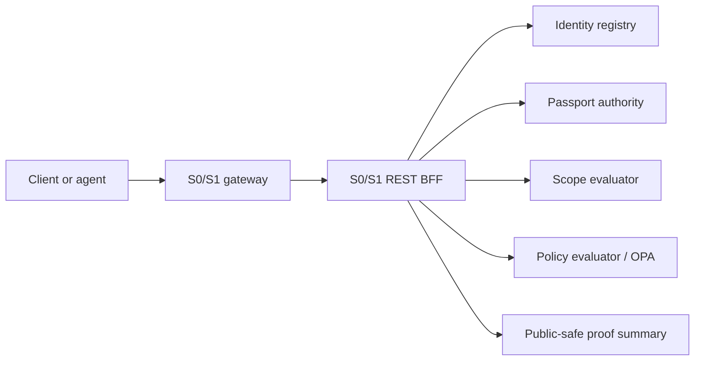

# ARE Foundation

[](https://github.com/srex-dev/are-foundation/actions/workflows/foundation-ci.yml)
[](https://github.com/srex-dev/are-foundation/actions/workflows/release-readiness.yml)
[](LICENSE)
[](SECURITY.md)

ARE Foundation is the Apache-2.0 S0/S1 wedge of the Agent Runtime Environment.

It lets you run the foundation of governed agent authority before any customer
action executes:

1. Register an actor.
2. Issue scoped authority.
3. Evaluate scope and policy.
4. Produce public-safe proof basics with `executed=false`.

This repository is intentionally not the full commercial ARE platform. It does not include Command Center, visual RAG, the client demo frontend, BYOPolicy commercial UX, synthetic emulator proof packets, S2-S6 adaptive stages, or governance-strata internals.

## Project Status

ARE Foundation is an early `0.1.x` foundation release. It is meant for local
development, evaluation, examples, and integration experiments around governed
agent authority. It is not a production certification product, does not execute
customer actions by default, and does not represent full ARE governance coverage.

## Why It Exists

ARE Foundation answers the first governance questions an agent runtime needs:

- Who is acting?
- What scoped authority does the actor hold?
- Does the requested action match that scope?
- Does policy allow, deny, or require a stronger gate?
- What public-safe proof can be shown without exposing secrets or payloads?

It is useful for platform engineers, AI governance teams, agent framework builders,
and policy/runtime engineers who want a small runnable foundation for authority
and policy checks.

## Architecture At A Glance



The gateway is the public perimeter. The S0/S1 REST BFF coordinates identity,
passport, scope, policy, and proof-root foundation services. Proof summaries are
safe to inspect and keep `executed=false`.

## What You Can Run

Public S0/S1 REST surface:

- `POST /v1/identity/agents`
- `GET /v1/identity/agents/{agent_id}`
- `POST /v1/passports`
- `GET /v1/passports/by-agent/{agent_id}`
- `POST /v1/passports:verify`
- `POST /v1/enforcement/scope:evaluate`
- `POST /v1/policy/evaluations`
- `GET /v1/meta/deployment`
- `GET /v1/platform/health`
- `GET /health` on the direct BFF health port
- `GET /metrics`

Mutating/check paths require:

- `Authorization`
- `X-Request-ID`
- `X-ARE-Agent-ID`
- `Idempotency-Key` where applicable

## Quick Start

```bash
make certs
make up
make smoke
make pressure
make pressure-matrix
```

The local compose gateway listens on `http://localhost:18085` to avoid colliding with a full ARE developer stack.

The Compose stack is local-dev only. It uses guarded dev-mode flags such as the
test token bypass and anonymous metrics so the laptop flow is easy to run. See
`docs/dev-mode-security.md` before adapting anything beyond localhost.

### Developer CLI

You can also use the checked-in helper CLI:

```bash
./bin/are-foundation up
./bin/are-foundation smoke
./bin/are-foundation pressure
```

The helper is a thin developer bootstrap around the same Docker Compose and test
scripts. It does not install production services or execute customer actions.

### Homebrew Bootstrap

Homebrew support is intended for local developer setup after the public tap is
published:

```bash
brew tap srex-dev/are
brew install are-foundation
are-foundation up
are-foundation smoke
```

Docker Compose remains the runtime. See `docs/homebrew.md` for the tap
publication checklist and formula template. Use the first public release tag
that includes `bin/are-foundation` for the tap; if `v0.1.0` predates that helper,
cut `v0.1.1` or later.

### Agent Integration Examples

MCP, LangGraph, CrewAI, and AutoGen examples live in
[`srex-dev/are-agent-integrations`](https://github.com/srex-dev/are-agent-integrations).
That repo shows how to wrap agent tool calls with ARE Foundation passport, scope,
and policy checks without importing the commercial Command Center surface.

`make smoke` runs a public-safe flow:

```text
register agent -> issue passport -> evaluate scope -> evaluate policy -> write public proof summary
```

No customer action is executed by default.

Expected result: a fake actor, a scoped passport, allow/deny checks, and a
public-safe proof summary that can be inspected without exposing headers,
credentials, signatures, raw payloads, or protected evidence bodies.

`make pressure` runs a public-safe authority-path load check:

```text
register fake authority pool -> verify passport -> evaluate scope -> evaluate policy -> list passports
```

It reports achieved RPS, p95/p99 latency, endpoint mix, and error rate under `reports/foundation-pressure/`. It still keeps `executed=false` and `receipt_created=false`.

You can tune it directly:

```bash
python tools/smoke/foundation_pressure.py --target-rps 50 --duration-seconds 30 --concurrency 16
```

`make pressure-matrix` runs an RPS ladder and writes `reports/foundation-pressure-matrix/latest-matrix.json`:

```bash
python tools/smoke/foundation_pressure_matrix.py --levels 50,100,200,400 --duration-seconds 30
```

## Developer Gates

```bash
make test
make gate
make release-audit
```

`make gate` runs tests and the OSS hygiene scan. Runtime smoke is separate with `make up && make smoke`.

Before cutting a public release or major public update, run the release checklist in `docs/oss-release-checklist.md`.

## Deeper Docs

- Architecture: `docs/architecture.md`
- API contract and end-to-end curl flow: `docs/api-contract.md`
- Public/commercial boundary: `docs/public-boundary.md`
- Foundation scope and limitations: `docs/foundation-scope-and-limitations.md`
- Deployment boundary: `docs/deployment-boundary.md`
- Dev-mode security: `docs/dev-mode-security.md`
- Governance-strata integration hook: `docs/governance-strata-integration.md`
- Homebrew developer bootstrap: `docs/homebrew.md`
- Threat model: `docs/threat-model.md`
- Release checklist: `docs/oss-release-checklist.md`
- Security policy: `SECURITY.md`
- Contributing guide: `CONTRIBUTING.md`
- Code of conduct: `CODE_OF_CONDUCT.md`

## Repo Layout

```text
sx/are-api-gateway       Public S0/S1 gateway perimeter
sx/s0s1-rest-bff         S0/S1 REST BFF
s0/agent-registry-service
s0/passport-issuance-engine
s0/immutable-ledger      Proof-root foundation pieces
s1/scope-evaluator-runtime
s1/opa-integration-layer
api/openapi.yaml         Public API slice
examples/                Public-safe flows
```

## Boundary

ARE Foundation can evaluate authority and policy. It does not execute customer actions, does not claim certification, and does not represent full ARE governance coverage.

Higher-risk transitions can be wrapped by governance-strata in the commercial platform. This OSS repo only documents that integration concept.

This repo ships local Docker Compose for development and evaluation. It does not
ship Helm, Terraform, Kubernetes/OpenShift manifests, production ingress, managed
identity, secret management, or a production support boundary in v0.1.x.

## Contributing

Contributions are welcome for the public S0/S1 surface: identity, passports,
scope evaluation, policy evaluation, proof-root basics, examples, docs, tests,
and developer tooling.

Please read `CONTRIBUTING.md` and `CODE_OF_CONDUCT.md` before opening an issue or
pull request. Commercial-only surfaces such as Command Center, visual RAG,
private proof packets, S2-S6 adaptive stages, and governance-strata internals are
out of scope for this repository.

## Security

Please do not open public issues for vulnerabilities or sensitive material. Use
the private reporting path in `SECURITY.md`.

Do not include tokens, credentials, raw headers, signatures, protected evidence,
raw customer payloads, or private proof packets in issues, pull requests, logs,
examples, or public reports.

## Roadmap

Near-term public foundation work:

- Homebrew tap publication after the first public tag containing the helper CLI.
- SDK and client examples for the S0/S1 REST surface.
- Clearer policy and scope evaluation examples.
- Hardened public-safe proof summaries.
- Optional observability hooks that do not expose commercial Command Center code.
- Explicit future-design notes for delegation, recovery, and sensitive proof
  without moving those higher-stage systems into the foundation repo.

## Support

Use GitHub issues for public bugs, docs gaps, and feature requests that fit the
S0/S1 foundation boundary. For security concerns, use `SECURITY.md` instead of a
public issue.

## License

ARE Foundation is licensed under the Apache License 2.0. See `LICENSE` and
`NOTICE`.
