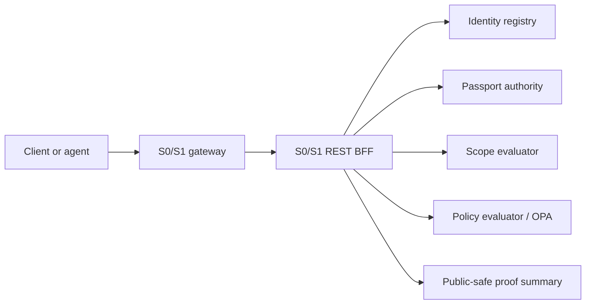

# ARE Foundation

ARE Foundation is the Apache-2.0 S0/S1 wedge of the Agent Runtime Environment.

It lets you run the foundation of governed agent authority before any customer
action executes:

1. Register an actor.
2. Issue scoped authority.
3. Evaluate scope and policy.
4. Produce public-safe proof basics with `executed=false`.

This repository is intentionally not the full commercial ARE platform. It does not include Command Center, visual RAG, the client demo frontend, BYOPolicy commercial UX, synthetic emulator proof packets, S2-S6 adaptive stages, or governance-strata internals.

## Why It Exists

ARE Foundation answers the first governance questions an agent runtime needs:

- Who is acting?
- What scoped authority does the actor hold?
- Does the requested action match that scope?
- Does policy allow, deny, or require a stronger gate?
- What public-safe proof can be shown without exposing secrets or payloads?

It is useful for platform engineers, AI governance teams, agent framework builders,
and policy/runtime engineers who want a small runnable foundation for authority
and policy checks.

## Architecture At A Glance



The gateway is the public perimeter. The S0/S1 REST BFF coordinates identity,
passport, scope, policy, and proof-root foundation services. Proof summaries are
safe to inspect and keep `executed=false`.

## What You Can Run

Public S0/S1 REST surface:

- `POST /v1/identity/agents`
- `GET /v1/identity/agents/{agent_id}`
- `POST /v1/passports`
- `GET /v1/passports/by-agent/{agent_id}`
- `POST /v1/passports:verify`
- `POST /v1/enforcement/scope:evaluate`
- `POST /v1/policy/evaluations`
- `GET /health`
- `GET /metrics`

Mutating/check paths require:

- `Authorization`
- `X-Request-ID`
- `X-ARE-Agent-ID`
- `Idempotency-Key` where applicable

## Quick Start

```bash
make certs
make up
make smoke
make pressure
make pressure-matrix
```

The local compose gateway listens on `http://localhost:18085` to avoid colliding with a full ARE developer stack.

`make smoke` runs a public-safe flow:

```text
register agent -> issue passport -> evaluate scope -> evaluate policy -> write public proof summary
```

No customer action is executed by default.

Expected result: a fake actor, a scoped passport, allow/deny checks, and a
public-safe proof summary that can be inspected without exposing headers,
credentials, signatures, raw payloads, or protected evidence bodies.

`make pressure` runs a public-safe authority-path load check:

```text
register fake authority pool -> verify passport -> evaluate scope -> evaluate policy -> list passports
```

It reports achieved RPS, p95/p99 latency, endpoint mix, and error rate under `reports/foundation-pressure/`. It still keeps `executed=false` and `receipt_created=false`.

You can tune it directly:

```bash
python tools/smoke/foundation_pressure.py --target-rps 50 --duration-seconds 30 --concurrency 16
```

`make pressure-matrix` runs an RPS ladder and writes `reports/foundation-pressure-matrix/latest-matrix.json`:

```bash
python tools/smoke/foundation_pressure_matrix.py --levels 50,100,200,400 --duration-seconds 30
```

## Developer Gates

```bash
make test
make gate
make release-audit
```

`make gate` runs tests and the OSS hygiene scan. Runtime smoke is separate with `make up && make smoke`.

Before making the repository public, run the release checklist in `docs/oss-release-checklist.md`.

## Deeper Docs

- Architecture: `docs/architecture.md`
- Public/commercial boundary: `docs/public-boundary.md`
- Governance-strata integration hook: `docs/governance-strata-integration.md`
- Threat model: `docs/threat-model.md`
- Release checklist: `docs/oss-release-checklist.md`

## Repo Layout

```text
sx/are-api-gateway       Public S0/S1 gateway perimeter
sx/s0s1-rest-bff         S0/S1 REST BFF
s0/agent-registry-service
s0/passport-issuance-engine
s0/immutable-ledger      Proof-root foundation pieces
s1/scope-evaluator-runtime
s1/opa-integration-layer
api/openapi.yaml         Public API slice
examples/                Public-safe flows
```

## Boundary

ARE Foundation can evaluate authority and policy. It does not execute customer actions, does not claim certification, and does not represent full ARE governance coverage.

Higher-risk transitions can be wrapped by governance-strata in the commercial platform. This OSS repo only documents that integration concept.
