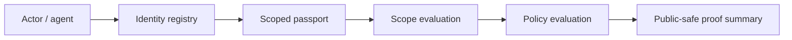

# Architecture

ARE Foundation has one narrow job: make agent authority observable and testable before any action is executed.

The gateway is the public front door. The S0/S1 REST BFF owns the foundation REST surface. OPA can be used for policy evaluation, or the local stub can be used for development.

## Source Truth

- Identity: agent registry records
- Authority: passport summaries and active status
- Scope: passport scope set matching action/resource
- Policy: OPA decision or local deny-by-default demo policy
- Proof: public-safe summary with source refs and `executed=false`

